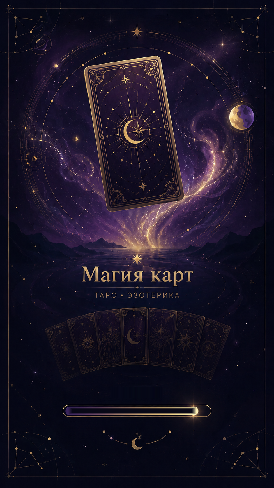

# 🔮 Магия Карт — AI Таро & Эзотерика | Telegram Mini App

<p align="center">
  
</p>

<p align="center">
  <b>AI-генерируемые таро-расклады и эзотерические практики прямо в Telegram</b><br/>
  22 типа раскладов · 78 карт · 3 языка · Telegram Stars платежи · Премиум подписка
</p>

<p align="center">
  <a href="https://t.me/cardsofmagic_bot">🤖 @cardsofmagic_bot</a>
</p>

---

## ✨ Возможности

### 🃏 Таро-расклады (AI-генерация)

| Расклад | Оракулы | Описание |
|---------|---------|----------|
| 🌅 Карта дня | Бесплатно | Одна карта + прогноз на день (раз в сутки) |
| ✅ Да / Нет | 77 | Одна карта — чёткий ответ на вопрос |
| ⏳ Прошлое — Настоящее — Будущее | 111 | Три карты по оси времени |
| 💕 На отношения | 111 | Расклад на любовь и партнёрство |
| 🧠 Что обо мне думает | 222 | Что чувствует к вам конкретный человек |
| 💰 Карьера и деньги | 333 | Финансы, работа, перспективы |
| 📅 На неделю | 222 | 7 карт — прогноз на каждый день |
| 🗓️ На месяц | 333 | Развёрнутый прогноз на месяц |
| ✝️ Кельтский крест | только Premium | Классический полный расклад (10 карт) |
| ❓ Свободный вопрос | 77 | Любой вопрос — карты ответят |

### 🔮 Эзотерические практики

| Практика | Оракулы | Описание |
|----------|---------|----------|
| ♈ Гороскоп | 111 | Персональный гороскоп по знаку зодиака |
| ᚱ Руны | 111 | Рунический расклад с толкованием |
| 💤 Толкование снов | 111 | AI-анализ сновидений |
| 👼 Ангельские числа | 333 | Расшифровка числовых знаков |
| 🌙 Лунная фаза | 222 | Влияние текущей фазы Луны |
| 🔢 Нумерология | 333 | Числовой анализ по дате рождения |
| 🧘 Чакры | 222 | Диагностика и рекомендации |
| 💞 Совместимость | 111 | Совместимость двух людей |
| 🕰️ Прошлые жизни | 222 | Регрессия и кармический анализ |
| 🔯 Матрица судьбы | 777 | Разбор по дате рождения — предназначение, деньги, отношения, род |
| 🪐 Натальная карта | 1111 | Полная карта рождения с визуализацией |
| 🧠 Прочитай меня | 100 | Психологический портрет по свободному вопросу |

### 👑 Премиум-подписка

Безлимитный доступ ко всем функциям без траты оракулов, плюс эксклюзивный расклад «Кельтский крест».

| План | Цена | Экономия vs помесячно |
|------|------|----------|
| 1 месяц | 499 ⭐ | — |
| 3 месяца | 999 ⭐ | ~33% |
| 1 год | 2 499 ⭐ | ~58% |

**Что даёт Премиум:**
- ♾️ Безлимит на все расклады и практики (оракулы не тратятся)
- 👑 Золотое оформление интерфейса (рамка, аура, корона)
- 🌅 Карта дня — 1 раз в сутки (как обычно)
- 💎 Оракулы сохраняются на балансе на случай окончания подписки

### 💎 Экономика (Оракулы = мана)

Цены на 1⭐ ниже реальных пачек Stars в Telegram (250/500/1000/2500⭐) — «круглое»
число всё равно оплачивается целиком, но воспринимается как более выгодное.

| Пакет | Оракулы | Цена (Stars) | Бонус к базовому курсу |
|-------|---------|---------------|------------------------|
| Разведка | 750 | 249 ⭐ | — |
| Стандарт | 1 750 | 499 ⭐ | +16% |
| Расширенный | 4 000 | 999 ⭐ | +33% |
| Макс | 11 000 | 2 499 ⭐ | +46% |

- Стартовый баланс: **200 оракулов**
- Ежедневный бонус (стрик): **+50** (7-й день: **+300**)
- Подписка на канал: **+1 000 оракулов** (одноразово)
- Реферальная система: **+500 оракулов** за приведённого друга

### 🎮 Геймификация

- 🃏 **Коллекция** — собирайте все 78 карт (22 Старших + 56 Младших Арканов)
- 🔥 **Стрики** — заходите каждый день и получайте бонусы
- 📺 **Подписка на канал** — +1000 оракулов за подписку
- 👥 **Рефералы** — приглашайте друзей, получайте награды

### 🌍 Мультиязычность

Автоопределение по `language_code` из Telegram:
- 🇷🇺 Русский (ru, be)
- 🇺🇦 Українська (uk)
- 🇬🇧 English (все остальные)

Весь контент, UI и AI-ответы — на языке пользователя.

---

## 🏗️ Технологический стек

| Слой | Технологии |
|------|-----------|
| **Frontend** | Next.js 14, React 18, Tailwind CSS, Framer Motion |
| **Backend** | Next.js API Routes (serverless, Vercel) |
| **AI / LLM** | Groq API (`llama-3.3-70b-versatile`), OpenRouter (DeepSeek — натальные карты) |
| **Генерация изображений** | Pollinations AI (натальные карты) |
| **БД** | PostgreSQL через Prisma ORM |
| **Платежи** | Telegram Stars (XTR) |
| **Хостинг** | Vercel (автодеплой из main) |
| **Тесты** | Vitest |

---

## 📁 Структура проекта

```
src/
├── app/
│   ├── api/
│   │   ├── card-of-day/          — Карта дня (1 раз/сутки)
│   │   ├── reading/              — Генерация AI расклада (таро)
│   │   ├── reading-lite/         — Лёгкие расклады (нумерология, руны, гороскоп и т.д.)
│   │   ├── followup/             — Дополнительные вопросы к раскладу
│   │   ├── payment/              — Оплата через Telegram Stars
│   │   ├── webhook/              — Telegram Bot webhook + админ-команды
│   │   ├── user/                 — Авторизация, профиль, премиум-статус
│   │   ├── check-subscription/   — Проверка подписки на канал
│   │   ├── admin/                — Веб-панель администратора
│   │   ├── cron/                 — Cron задачи (стрики, webhook)
│   │   ├── setup-bot/            — Настройка Telegram бота
│   │   └── support/              — Система поддержки
│   ├── globals.css               — Глобальные стили + анимации
│   ├── layout.tsx
│   └── page.tsx                  — SPA точка входа (Telegram Mini App)
│
├── components/
│   ├── layout/                   — Экраны приложения
│   │   ├── HomeScreen.tsx        — Главная (карта дня, навигация)
│   │   ├── SpreadListScreen.tsx  — Список раскладов (таро / эзотерика)
│   │   ├── SpreadScreen.tsx      — Процесс расклада
│   │   ├── ReadingScreen.tsx     — Результат расклада
│   │   ├── HistoryScreen.tsx     — История раскладов
│   │   ├── CollectionScreen.tsx  — Коллекция карт
│   │   ├── ShopScreen.tsx        — Магазин (премиум + оракулы)
│   │   ├── ProfileScreen.tsx     — Профиль пользователя
│   │   └── BottomNav.tsx         — Нижняя навигация
│   └── ui/                       — UI компоненты
│       ├── LoadingScreen.tsx     — Загрузочный экран
│       ├── StarField.tsx         — Звёздный фон (анимация)
│       ├── SolarSystem.tsx       — Солнечная система (фон)
│       ├── ManaBalance.tsx       — Баланс оракулов (♾️ для премиум)
│       ├── ManaModal.tsx         — Модалка «Не хватает оракулов»
│       ├── ManaIcon.tsx          — Иконка оракула
│       ├── NatalChartWheel.tsx   — Визуализация натальной карты
│       ├── NatalLoadingScreen.tsx
│       └── ErrorBoundary.tsx     — Обработка ошибок
│
├── data/
│   ├── tarot-cards.ts            — 78 карт (названия RU/UK/EN, ключевые слова)
│   └── spreads.ts                — Конфигурация всех 22 раскладов
│
├── lib/
│   ├── ai/
│   │   ├── clients.ts            — Groq + OpenRouter клиенты
│   │   ├── image.ts              — Генерация изображений (Pollinations)
│   │   └── prompts/              — Системные промпты для AI
│   │       ├── tarot.ts          — Промпты для таро-раскладов
│   │       └── esoteric.ts       — Промпты для эзотерики
│   ├── telegram.ts               — Telegram Bot API утилиты
│   ├── db.ts                     — Prisma клиент (singleton)
│   ├── premium.ts                — Премиум: проверка, выдача, отзыв
│   ├── rate-limit.ts             — Rate limiting (DB-backed)
│   ├── user-limits.ts            — Лимиты, мана, премиум-байпасс
│   ├── natal.ts                  — Расчёт натальной карты
│   ├── auth.ts                   — Валидация Telegram initData
│   └── haptics.ts                — Тактильная обратная связь
│
├── store/
│   └── app-store.ts              — Zustand стейт-менеджер
│
└── __tests__/                    — Тесты (Vitest)
    ├── user-limits.test.ts
    ├── rate-limit.test.ts
    └── reading.test.ts
```

### 🎨 Ассеты

```
public/
├── cards/
│   ├── major/          — 22 старших аркана (.png, 400×600)
│   └── minor/          — 56 младших арканов (.webp, 400×600)
│       ├── wands-01..14
│       ├── cups-01..14
│       ├── swords-01..14
│       └── pentacles-01..14
└── ui/
    ├── nav/            — Иконки навигации
    ├── spreads/        — Хедеры раскладов (.webp)
    └── ...             — Прочие UI элементы
```

### 🗃️ База данных (Prisma)

| Модель | Назначение |
|--------|-----------|
| **User** | Telegram ID, имя, мана, стрики, язык, премиум-статус |
| **Reading** | История раскладов (тип, вопрос, результат, карты) |
| **Payment** | Платежи через Telegram Stars |
| **Subscription** | Премиум-подписки (план, срок действия) |
| **Referral** | Реферальная система |
| **CardCollection** | Собранные карты пользователя |
| **RateLimit** | Rate limiting по endpoint'ам |

---

## 🤖 Админ-команды (Telegram Bot)

Доступны пользователям из `ADMIN_USERNAMES`. При начислении оракулов и выдаче/отзыве премиума пользователь получает уведомление в Telegram.

### 💎 Оракулы
```
/mana @username 500      — начислить 500 оракулов
/mana @username -100     — снять 100 оракулов
/setmana @username 1000  — установить ровно 1000
/balance @username       — посмотреть баланс
```

### 👑 Премиум
```
/premium_grant @username 30   — дать премиум на 30 дней
/premium_revoke @username     — забрать премиум
/premium_status @username     — проверить статус
```

### 📊 Статистика
```
/stats           — общая статистика
/users           — последние 10 юзеров
/find @username  — найти юзера
/check           — юзеры + новые с последней проверки
/stars           — баланс и транзакции Stars
```

### 🃏 Прочее
```
/resetcotd             — сбросить свою карту дня
/resetcotd @username   — сбросить карту дня юзеру
/unlockall @username   — открыть все 78 карт
/lockall @username     — закрыть все карты
```

> Вместо `@username` можно использовать Telegram ID.

---

## 🚀 Запуск

### Предварительные требования
- Node.js 18+
- PostgreSQL
- Telegram Bot Token (через [@BotFather](https://t.me/BotFather))
- Groq API Key ([console.groq.com](https://console.groq.com))

### Установка

```bash
# Клонировать репозиторий
git clone https://github.com/d1mambaway/tarot-ai-app.git
cd tarot-ai-app

# Установить зависимости
npm install

# Настроить Prisma
npx prisma generate
npx prisma db push

# Настроить переменные окружения
cp .env.example .env
# → заполнить все переменные (см. ниже)

# Запустить dev-сервер
npm run dev
```

### Переменные окружения

| Переменная | Описание | Обязательная |
|-----------|----------|:---:|
| `TELEGRAM_BOT_TOKEN` | Токен бота из @BotFather | ✅ |
| `GROQ_API_KEY` | Ключ Groq API | ✅ |
| `GROQ_MODEL` | Модель Groq (по умолчанию `llama-3.3-70b-versatile`) | ❌ |
| `DATABASE_URL` | URL PostgreSQL | ✅ |
| `NEXT_PUBLIC_APP_URL` | URL приложения (для webhook) | ✅ |
| `NEXT_PUBLIC_TG_BOT_USERNAME` | Username бота без @ | ✅ |
| `OPENROUTER_API_KEY` | Ключ OpenRouter (для натальных карт) | ❌ |
| `OPENROUTER_MODEL` | Модель OpenRouter (по умолчанию `deepseek/deepseek-chat`) | ❌ |
| `ADMIN_USERNAMES` | Админы через запятую, без @ (напр. `d1mamba,admin2`) | ❌ |
| `ADMIN_SECRET` | Секрет для веб-панели администратора | ❌ |
| `SUPPORT_BOT_TOKEN` | Токен бота поддержки | ❌ |
| `SUPPORT_ADMIN_CHAT_ID` | Chat ID для тикетов поддержки | ❌ |
| `CRON_SECRET` | Секрет для cron-задач | ❌ |

### Настройка Webhook

```bash
curl "https://api.telegram.org/bot<TOKEN>/setWebhook?url=https://your-app.vercel.app/api/webhook"
```

> При деплое на Vercel webhook автоматически обновляется через cron-задачу.

---

## 🧪 Тесты

```bash
npx vitest run
```

37 тестов: rate limiting, user limits (включая премиум-байпасс), reading API.

---

## 📄 Лицензия

Проприетарный проект. Все права защищены.
